<picture>
  <source media="(prefers-color-scheme: dark)" srcset="dark.svg">
  <source media="(prefers-color-scheme: light)" srcset="light.svg">
  
</picture>

AIML student focused on AI systems, simulations, and full-stack applications.

Building practical software combining AI, engineering, and design.

---

## 🚀 Interests
- Agentic AI
- Local-first AI
- Full-stack apps
- Real-time simulations
- UI/UX engineering

---

## 🛠️ Projects
- **Kiosk** — Open-source PDF reader spanning web, desktop, mobile, and browser extensions
- **ido** — Minimalist, open-source task tracker built for speed and clean architecture
- **NutriScan** — Turns a phone into a nutrition scanner using the OpenFoodFacts database
- **Axiom** — A Minecraft bot that thinks and defends itself, built with Mineflayer + a local LLM via Ollama

---

## 💻 Stack
Python • TypeScript • Kotlin • Rust • React • Next.js • Flutter • Tauri

Git • Docker • Google Cloud • Cloudflare • Claude Code • Figma

---

🌐 https://sarthakg.com
